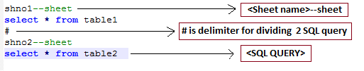

# MSSql-to-Excel

This is a simple implementation in Python to run query in MS-SQL and insert results in an xlsx sheet.

**Note: This only works on Excel 2010 and above format.**

# Installing
1. Python 2 should be installed on the system.
1. This script depends on following two python modules for installing them run the following command  **pip install pyodbc openpyxl**

# SQL File format

